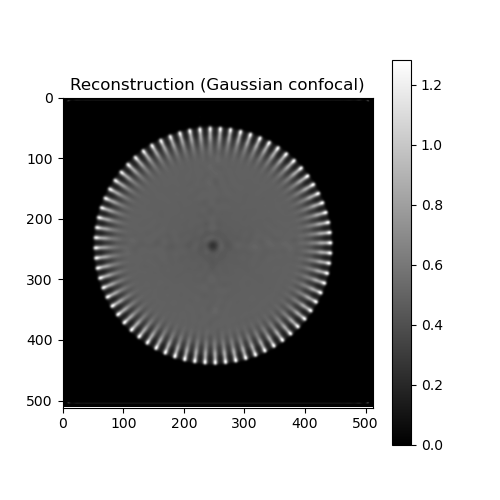
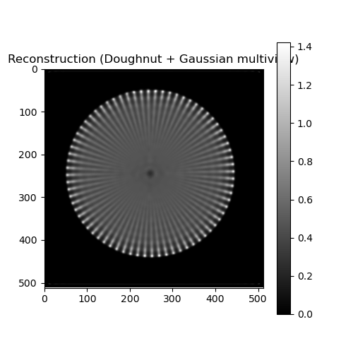

# Nonlinear Focal Modulation Microscopy

Demo code for the key algorithm and methodology part of nonlinear focal modulation microscopy (NFOMM).


## Teaser (star test)

| Ground truth | Confocal baseline | NFOMM |
|--------------|-------------------|--------------------|
|  |  |  |

**Run:** 
```bash
python deconv_2d_demo.py
```
with `OBJECT_TYPE = "star"` to generate these results.

## Details of NFOMM methodology
See [core/nfomm.md](core/nfomm.md) for the full method  description (forward model, saturation, multiview RL deconvolution, OTF-weighted blending).

## Code Structure

```
nfomm/
├── deconv_2d_demo.py       # Main demo script
├── __init__.py             # Package initialization
├── core/
│   ├── imaging.py          # NFOMM forward model and Imaging class
│   ├── multiview_deconv.py # Richardson-Lucy deconvolution (single/multiview)
│   ├── psf.py              # PSF generation (doughnut, gaussian)
│   ├── saturation.py       # Saturation model g(I)
│   ├── params.py           # Configuration parameters
│   ├── utils.py            # Utility functions
│   ├── frc.py              # Fourier Ring Correlation analysis
│   └── nfomm.md            # Model documentation
├── data/
│   ├── star_test.png       # Star test pattern
│   └── barbara_gray.jpg    # Barbara test image
└── results/
    ├── star/               # Star test results
    │   ├── reconstruction/
    │   ├── blurred/
    │   ├── psf/
    │   ├── ground_truth/
    │   └── frc/
    └── barbara/            # Barbara results
```

## Usage

Run the demo:
```bash
cd deconv_2d_demo
python deconv_2d_demo.py
```

## Output

The demo will:
1. Create a 2D test object
2. Generate a doughnut PSF (using vortex phase mask)
3. Generate a Gaussian PSF (using zero phase mask)
4. Create blurred images with each PSF
5. Save all PSFs, images, and objects as TIFF files in `data/psf_comparison/`

## Citation
If you find our paper, code or any of our materials useful, please cite our paper:

```bibtex
@article{zhao2018nonlinear,
  title={Nonlinear focal modulation microscopy},
  author={Zhao, Guangyuan and Zheng, Cheng and Kuang, Cuifang and Zhou, Renjie and Kabir, Mohammad M and Toussaint Jr, Kimani C and Wang, Wensheng and Xu, Liang and Li, Haifeng and Xiu, Peng and others},
  journal={Physical review letters},
  volume={120},
  number={19},
  pages={193901},
  year={2018},
  publisher={APS}
}
```